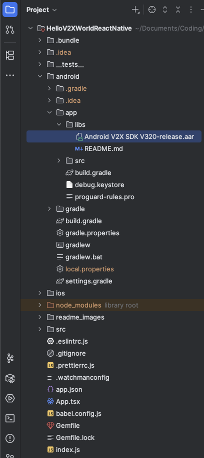

# HelloV2XWorld-ReactNative

In this repository you can find an example of V2X application that shows how to use the V2X-SDK in a ready to use React Native (Android/iOS) Application.

## Description

The HelloV2XWorld application demonstrates how easy it is to create a V2X application and exchange V2X messages with other road users .
This application is powered by the V2X-SDK and the STEP platform developed by Vodafone.
By cloning this project, you will be able to create and execute your first V2X application in less than 2 hours.
The HelloV2XWorld application shows a map with all the road users close to your location.
You can also use this application as a model to start developing your own application.

## Getting Started

### Prerequisites

* Android Studio (2022.1.1 or upper) and Android SDK, NDK and CMake installed through the Android Studio SDK Manager.
* JDK 17 or above is already installed on your laptop.
* XCode installed for iOS app build and configurations.
* Any IDE you prefer: Intellij, VS Code, Sublime, ... etc.
* A software able to open rar & zip archives is already installed on your laptop.
* You have some experience in React Native application development in JavaScript/TypeScript.
* You already created and started One virtual device in Android Studio (Android 8 or higher with Google Play Services 'select devices with play store icons').
* You already created and started One virtual device in XCode.
* Your Internet connectivity is strong and up and running.
* You are available for around two hour.

### Download the V2X-SDK library for Android

* Register yourself on the [STEP Web portal](https://step.vodafone.com/)    
  

* Go to the [STEP Web portal](https://step.vodafone.com/) webpage and login.  
  **=>Enter your credentials**   
    
  **=>Enter your pin Code**   
  

* Navigate to the [Access SDK page](https://de-he.step.vodafone.com/portal/SAFETY-V2X) and select the "Get SDK for Android" option.  
  

* In the "SDK documentation for Android" page , click on the "Download SDK" button.  
    
  **=> Your browser downloads the archive "VodafoneV2X_Android_SDK.rar"**
* Open the archive, extract the V2X-SDK library file called "Android V2X SDK Vxyz-release.aar" and save it on your laptop.

### Download the Android V2X-SDK documentation

* In the "SDK documentation for Android" page , click on the "Download documentation" button.  
  

  **=> Your browser downloads the archive "Android_V2X_SDK_Documentation_Vabc.zip"**
* Open the archive and save on your laptop the Javadoc and the user Guide

### Download the V2X-SDK library for iOS

* Navigate to the [Access SDK page](https://de-he.step.vodafone.com/portal/SAFETY-V2X) and select the "Get SDK for iOS" option.
  

* In the "SDK documentation for iOS" page.
  * click on the "Download SDK" button for the SDK xcframework.
  * click on the "Download documentation" button for the SDK documentation and user guide.
    

=> Your browser downloads the archive "VodafoneV2X_iOS_SDK.rar".
* Open the archive, extract the V2X-SDK library file called "VodafoneV2X.xcframework" and save it on your laptop.

### Retrieve the Application_ID & Application_Token & the Private Group, you will need these 3 parameters later to configure the HelloV2XWorld app.

* Go the [Test application](https://de-he.step.vodafone.com/applications) Test Application Web page.
* Click on the Test Application button

* Click on the Next Button two times
* Select the Application ID option and Copy the ApplicationID and save it as ApplicationID

* Select the SDK Key option , copy the SDK Key and save it as ApplicationToken

* Select the Private Topic option , copy the Number related to the publish/subscribe group and save it as CAM Publish Group & CAM Subscribe Group

### Clone the HelloV2XWorld Application

* Open Intellij IDEA.
* From start Screen select Get from VCS.  
    
  **=> A window called "Get from Version Control" appears.**

* In the field version Control select the option "Git".
* In the field URL set "https://github.com/Vodafone/HelloV2XWorld-ReactNative.git".
* Click on the "Clone" button.
  

* Wait until the completion of this operation.

### Import the Android V2X-SDK library in your project

* Copy the "Android V2X SDK Vxyz-release.aar" file to the app/libs folder of your project.  
  
* Make sure to update the SDK dependency name "xyz" part in the app/gradle.build to match the SDK version you downloaded.
  * ex.: implementation fileTree(dir: 'libs', include: ['Android V2X SDK V320-release.aar'])

### Import the iOS V2X-SDK library in your project

* Open Xcode and open the HelloV2XWorldReactNative.xcodeproj in <ProjectDirectory>/ios
* After opening the HelloV2XWorld project.
* Go to xcodproj settings page "General".
* Scroll down to "Frameworks" and click on the "+" sign.
  
* Choose "Add Others" then "Add Files" and select to add the pre-downloaded "VodafoneV2X.xcframework".
  

### Set the Application_ID & Application_Token & the Private Group in your project

### Set the CAM Publish Group & CAM Subscribe Group in your project (if different from default value)

### Set the Google Maps API Key for Android

* In Android App Manifest, replace the "GOOGLE_MAPS_API_KEY" with your google API key".

### Build the HelloV2XWorld application

#### Tech Dependencies

* Node.js & npm needs to be installed for the node modules and packages in the project (including react-native module).
  * Download and install from [Node.js website](https://nodejs.org/en) and follow the steps to install & check installation.
  * After installation process make sure everything is installed correctly.
    * Open a terminal and write:
      * node --version
      * npm --version
      * Close the terminal

###### Note: Terminal can be the normal terminal app or any terminal section in any IDE.

* Install All packages and node module inside the project directory.
  * Navigate to project directory and open a terminal:
    * npm install
    * Note that in some cases you might be requested for admin privilege so, enter your machine username and password.
    * OR, in macOS and Linux: sudo npm install
    * Close the terminal

* After installing all packages and node modules, you might need to change ownership of them on macOS/Linux:
  * Navigate to the project directory and open a terminal:
    * chown -R $(whoami) ~/Documents/ReactNative/HelloV2XWorld-ReactNative-main/node_modules
    * OR: sudo chown -R $(whoami) ~/Documents/ReactNative/HelloV2XWorld-ReactNative-main/node_modules
    * NOTE: remember to change above path with your path to project and node_modules directory inside it.
    * NOTE: you might need "sudo" or might not according to your privilege.
    * This command will run and might take some time till change all packages.
    * Close the terminal

* Set Some Environment Variables "ANDROID_HOME", "ANDROID_AVD_HOME":
  * Open a new terminal and run:
    * nano ~/.zshrc
    * Add inside the file:
      * export ANDROID_HOME=$HOME/Path/To/AndroidSDK
      * export PATH=\$PATH:$ANDROID_HOME/emulator
      * export PATH=\$PATH:$ANDROID_HOME/platform-tools
      * export PATH=\$PATH:$ANDROID_HOME/tools
      * export ANDROID_AVD_HOME=~/.android/avd
    * Press control+O -> enter -> control+X
    * Run: source ~/.zshrc
    * Close the terminal

* NOTE: You might need to adjust the $HOME variable before adding those new variables to be as base for other variables paths:
  * export HOME=~/Library
  * OR generally: export HOME=~/Entry-point-directory-to-android-sdk

* Starting the Dev Server (Metro Server).
  * Navigate to project directory and open a terminal:
    * npx react-native start
    * Dev server will start, and you will see this output.
    * Note: if npx react-native start didn't work, try instead:
      * npm start
      * This will do the same process

  

###### Keep this terminal window open and server up and running.

#### Start building the project (Android Version)

* Open a new terminal in the project directory (standalone terminal or through IDE you prefer).
  * react-native bundle --platform android --dev false --entry-file index.js --bundle-output android/app/src/main/assets/index.android.bundle --assets-dest android/app/src/main/res
  * This will bundle all changes to be used during building, then run:
  * npx react-native run-android
  * This will start building the android application and will launch the emulator.
  * All dependencies and react native packages dependencies will start downloading (this might take some time).
  * After download finishes, the application will start building.
  * After application build successfully, it will appear on the emulator.
  * Note: if npx react-native run-android didn't work, try instead:
    * npm run android
    * This will do the same process

###### NOTES/Common Problems:

  * You might need to set the project JDK to 17 or above through the project structure.
    * Open Project Structure from settings icon on top right.
    * Go to tab "Project Settings" => Project.
    * Select SDK to be JDK 17 or above.

  
  
  

  * Make sure to install NDK (side by side) and CMake from Android Studio SDK Manager.
    * Open Android Studio => Settings => Languages & Frameworks => Android SDK => SDK Tools Tab.
    * Select NDK (side by side) and CMake and Click Apply to install.

  

  * NDK path might be needed to be added in local.properties file.
    * Open local.properties file => add line:
      * ndk.dir=/Path/To/AndroidSDK/ndk
  * Make sure NDK version to be installed is: 26.1.10909125
    * Open Android Studio => Settings => Languages & Frameworks => Android SDK => SDK Tools Tab.
    * enable checkbox "Show Package Details".
    * Select version 26.1.10909125 under NDK (side by side) item and Click Apply to install.

  

  * After installing the NDK with version 26.1.10909125:
    * Navigate to directory of ndk version inside android sdk directory: /path/to/android-sdk/ndk/26.1.10909125
    * Copy file source.properties and Paste in directory /path/to/android-sdk/ndk/26.1.10909125
    * Open a new terminal and run:
      * sudo gem install ffi
      * Wait till the processing finished.
      * sudo gem install cocoapods
      * Wait till the processing finished.
      * pod install
      * Wait till the processing finished.
      * Close the terminal.

#### Start building the project (iOS Version)

* Open a new terminal in the project directory (standalone terminal or through IDE you prefer).
  * Navigate to ios project folder => cd ios
  * Install pods from the installed node modules and packages => pod install
  * After download and installation finished move back to project directory => cd ..
  * react-native bundle --platform ios --dev false --entry-file index.js --bundle-output ios/HelloV2XWorldReactNative/main.jsbundle --assets-dest ios/HelloV2XWorldReactNative
  * This will bundle all changes to be used during building, then run:
  * npx react-native run-ios
  * This will start building the android application and launch the iOS simulator.
  * After application build successfully, it will appear on the iOS simulator.
  * Note: if npx react-native run-ios didn't work, try instead:
    * npm run ios
    * This will do the same process

###### NOTES/Common Problems:

If you faced some issue with running iOS regarding pods or ruby:

* Open Terminal and run:
  * run => sudo gem install bundler
  * Wait till the processing finished.
  * run => bundle update cocoapods
  * Wait till the processing finished.
  * Using Bundler: If you have a Gemfile and want to use Bundler, run:
    * bundle install
  * run => bundle exec pod install
  * Wait till the processing finished.
  * if you face error: undefined method untaint' for "~/HelloV2XWorld-ReactNative-main/ios":String (NoMethodError) current = File.expand_path(SharedHelpers.pwd).untaint
    * Open this file: ~/HelloV2XWorld-ReactNative-main/vendor/bundle/ruby/3.2.0/gems/bundler-1.17.2/lib/bundler/shared_helpers.rb
    * Replace "current" value to:
      * current = File.expand_path(SharedHelpers.pwd)
  * remove derived data, clean and build in Xcode
  * run => npx react-native run-ios

#### Common Ruby Problems

If you faced some issue regarding Ruby versions, make sure to upgrade ruby version:

* Install rbenv (if not already installed):
  * Open Terminal and run:
    * brew install rbenv
    * Wait till the processing finished.
    * Initialize rbenv:
      * nano ~/.zshrc
      * Add inside the file:
        * eval "$(rbenv init -)"
        * Press control+O -> enter -> control+X
        * Run: source ~/.zshrc
        * Close the terminal
    * Install Ruby 3.2.5:
      * Open new terminal and run:
        * rbenv install 3.2.5
        * Wait till the processing finished.
        * Set Ruby 3.2.5 as the global version:
          * rbenv global 3.2.5
          * Wait till the processing finished.
        * Verify the installation:
          * ruby -v
      * Close the terminal
    
  
* After Installation of rbenv, Make sure to update your gems after switching versions:
  * Open new terminal and run:
    * gem update --system
  * Download Ruby 3.2.5 from the official Ruby website or use curl
    to download the tarball:
    * curl -O https://cache.ruby-lang.org/pub/ruby/3.2/
  * Extract the Downloaded File: Unpack the tarball:
    * tar -xzvf ruby-3.2.5.tar.gz
  * Navigate to the Extracted Directory:
    * cd ruby-3.2.5
  * Configure the Build: Use the --with-openssl-dir option to specify the OpenSSL directory:
    * ./configure --with-openssl-dir=$(brew --prefix openssl) --with- readline-dir=$(brew --prefix readline)
  * Compile the Source Code: This step can take some time, depending on your system:
    * make
  * Install Ruby: You might need to use sudo if you’re installing to a system-wide location:
    * sudo make install
  * Verify the Installation: Check that Ruby is installed correctly:
    * ruby -v
  * Update RubyGems: After installation, it’s a good practice to update RubyGems:
    * gem update --system
  * Cleanup: You can delete the downloaded and extracted files if you no longer need them:
    * cd .. 
    * rm -rf ruby-3.2.5 ruby-3.2.5.tar.gz
  * Close the Terminal.

#### Debugging on Xcode:
If you want to run the HelloV2XWorld iOS Application to debug it on the Simulator:
* Follow the above steps for running the App normally on the Simulator.
* Then, after it's installed and run successfully, in Xcode select the same Simulator.
* From the Debug menu, select Attach to Process, then choose the HelloV2xWorldReactNative App from the menu.
* Then, the App will be attached to Xcode, and you can debug normally.

### Run the HelloV2XWorld application on the virtual devices

**Please, be aware that the HelloV2XWorld application needs to access to your location , it's why it requests the Location Permission.**

* Read the Term and Conditions, Scroll down and click on the "Accept" button.  
  
  

* Provide the Location Permission to the HelloV2XWorld application  
  
  

* A map is displayed centered on your current location  
  
  

* The blue icon represents yourself
* The red icons represent the other road users close to you   
  
  

* When clicking on the blue icon, app displays you ITS information: StationID, StationType, Speed, Heading
  
  

* When clicking on any red icon, app displays you the CAM information: StationID, StationType, Speed, Heading
  
  

* You can change your station type by accessing the setting page
  
  

## Version History

* 1.0.3
  * Initial Release

## License

This project is licensed under the MIT License - see the LICENSE.md file for details

## Dependencies

* STEP V2X SDK for Android/iOS.
* react v18.2.0 / MIT License (C) Meta Platforms, Inc. and affiliates.
* react-native v0.74.4 / MIT License (C) Meta Platforms, Inc. and affiliates / CC-BY-4.0 License.
* react-native-blob-util v0.19.11 / MIT License (C) 2017 xeiyan@gmail.com.
* react-native-element-dropdown v2.12.1 / MIT License (C) 2023 Hoa Phan.
* react-native-exit-app v2.0.0 / MIT License (C) 2018 Wumke.
* react-native-maps v1.17.3 / MIT License (C) 2015 Airbnb.
* react-native-pdf v6.7.5 / MIT License (C) 2017 Wonday (@wonday.org).
* react-native-permissions v4.1.5 / MIT License (C) 2019 Mathieu Acthernoene.
* react-native-restart v0.0.27 / MIT License (C) 2020 Avishay Bar.
* react-native-safe-area-context v4.10.8 / MIT License (C) 2019 Th3rd Wave.
* react-native-screens v3.34.0 / MIT License (C) 2018 Software Mansion <swmansion.com>.
* react-navigation v5.0.0
* @react-native-async-storage/async-storage v1.24.0 / MIT License (C) 2015-present, Facebook, Inc.
* @react-navigation/native v6.1.18

#### Android Specific
* com.google.code.gson:gson v2.10.1 / Apache License 2.0
* com.hivemq:hivemq-mqtt-client v1.3.0 / Apache License 2.0
* group: 'org.apache.commons', name: 'commons-lang3' v3.12.0 / Apache License 2.0
* group: 'org.eclipse.paho', name: 'org.eclipse.paho.client.mqttv3' v1.2.5 / Apache License 2.0
